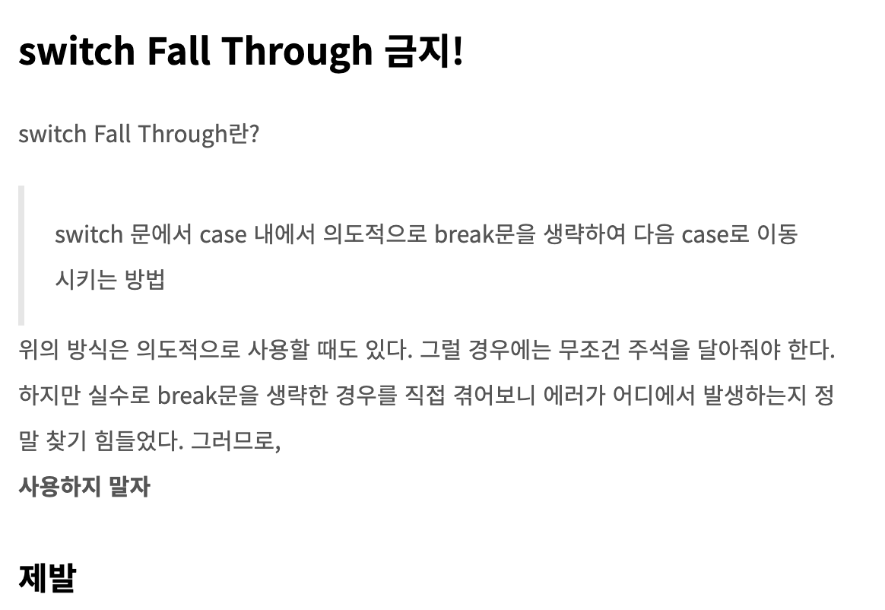

## if … else 와 삼항 연산자

if … else문은 삼항 조건 연산자로 바꿔 쓸 수 있음.

```jsx
// x가 짝수이면 result 변수에 문자열 '짝수'를 할당하고, 홀수이면 문자열 '홀수'를 할당한다.
var x = 2;
var result;

if (x % 2) {
  // 2 % 2는 0이다. 이때 0은 false로 암묵적 강제 변환된다.
  result = '홀수';
} else {
  result = '짝수';
}

console.log(result); // 짝수
```

```jsx
var x = 2;

// 0은 false로 취급된다.
var result = x % 2 ? '홀수' : '짝수';
console.log(result); // 짝수
```

만약 경우의 수가 세 가지라면? ⇒ (’양수’, ‘음수’, ‘영)

```jsx
var num = 2;

// 0은 false로 취급된다.
var kind = num ? (num > 0 ? '양수' : '음수') : '영';

console.log(kind); // 양수
```

## switch-case

### fall through

```jsx
// 월을 영어로 변환한다. (11 → 'November')
var month = 11;
var monthName;

switch (month) {
  case 11:
    monthName = 'November';
  case 2:
    monthName = 'February';
  case 3:
    monthName = 'March';
}

console.log(monthName); //  March
```

상당히 당황스럽다. break문이 없으면 밑에 있는 케이스로 넘어가는데 case 확인을 안 하고 그냥 실행한다. 그래서 위 코드 결과로는 `month = 11` 이지만 `March`가 콘솔에 찍힌다.

이를 **fall through** 라고 하는데 이는 개발할 때 용이하게 쓸 수도 있지만 에러가 날 확률이 크고, 어디서 에러가 나는지 찾기 어렵기에 **쓰지 않는 것이 좋을 것** 같다. `switch-case`를 쓸 때는 꼭 **break문을 잊지 말자.**



## if

### break 문

break문은 레이블 문, 반복문, switch문의 코드 블럭 외에서 사용하면 SyntaxError(문법 에러) 발생

```jsx
if (true) {
  break; // Uncaught SyntaxError: Illegal break statement
}
```

\*레이블 문 : 식별자가 붙은 문

- 레이블 문은 객체와 비슷하게 생겼기 때문에 헷갈려할 수 있다. ⇒ 비추천

```jsx
// foo라는 식별자가 붙은 레이블 블록문
foo: {
  console.log(1); // 1
  break foo; // foo 레이블 블록문을 탈출한다.
  console.log(2); // 출력x
}

console.log('Done!'); // Done!
```

```jsx
// outer라는 식별자가 붙은 레이블 for 문
outer: for (var i = 0; i < 3; i++) {
  for (var j = 0; j < 3; j++) {
    // i + j === 3이면 outer라는 식별자가 붙은 레이블 for 문을 탈출한다.
    if (i + j === 3) break outer;
    console.log(`inner [${i}, ${j}]`);
  }
}

console.log('Done!');

-----------------------------------------------------
console // i + j === 3인경우 출력x

inner [0, 0]
inner [0, 1]
inner [0, 2]
inner [1, 0]
inner [1, 1]
Done!
```
